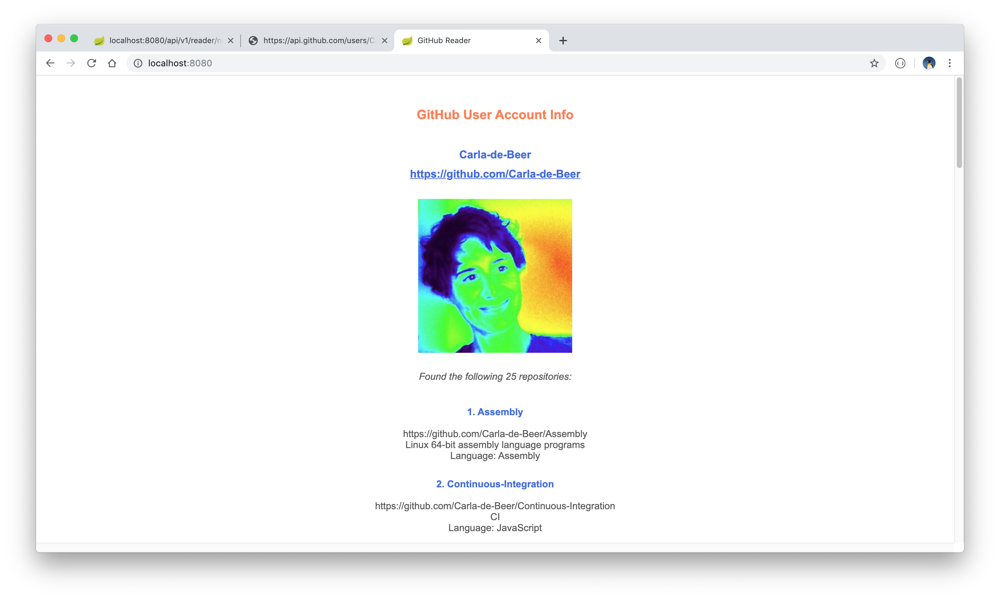
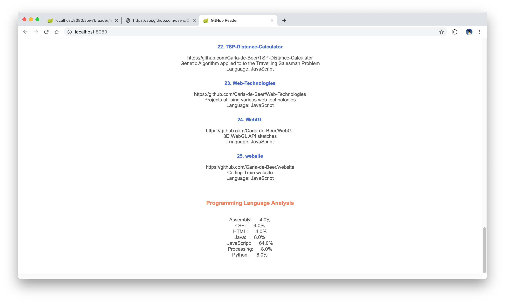

# GitHub Reader

A web-based reader to display GitHub repository information for a specific GitHub user given a valid GitHub account name.

The project was built with Spring Boot and ThymeLeaf and makes use of Java 8 and Maven.

## Getting started

Download the project, install the dependencies and start the server with `mvn spring-boot:run`. The landing page can then be viewed in a browser via the link: `http://localhost:8080/`. Enter a valid GitHub account name, when prompted, in order to display the relevant user repository information. Information displayed includes the following:
* The user name.
* A hyperlink to the user's repository.
* An associated avatar (if one is available).
* A confirmation of the total number of repositories found for this user.
* A summary of the repositories found.
* A brief analysis of the programming languages used in these repositories.

This project makes use of the [GitHub Developer API](https://developer.github.com/v3/).

 

  
  

