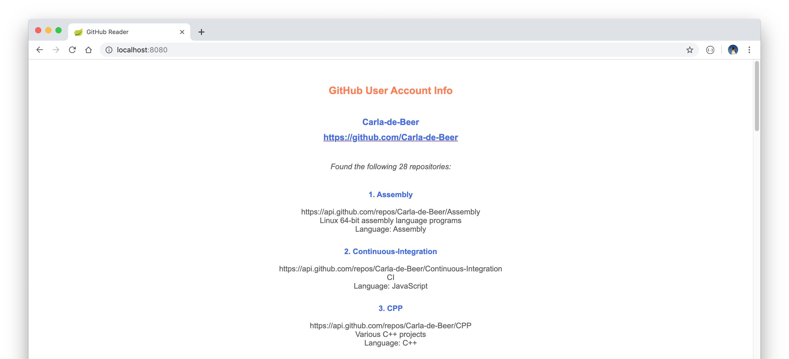

# GitHub Reader

A web-based reader to display GitHub repository information for a specific GitHub user given a valid GitHub personal access token.

The project was built with Spring Boot and makes use of Java 8 and Maven.

## Getting started

Download the directory and start the server with `mvn spring-boot:run`. The landing page can then be viewed in a browser via the link: `http://localhost:8080/`. Enter a valid GitHub personal access token, when prompted, in order to display the relevant user repository information. Information displayed includes the following:
* The user name.
* A hyperlink to the user's repository.
* A confirmation of the total number of repositories found for this user.
* A summary of the repositories found.
* A brief analysis of the programming languages used in these repositories.

This project makes use of the [EGit project](https://www.eclipse.org/egit/), implementing Eclipse tooling on top of the JGit Java implementation of Git.

Postman integration tests, written for the `ReaderRestController`-API, can be found in the directory `src/test/resources/Postman tests`. Replace the `<ENTER_TOKEN_HERE>` sections with a personal access token before executing them in the test runner.

TODO :  
  - [x] Integration tests
  - [ ] Unit tests
  - [x] Error handling

 

  

