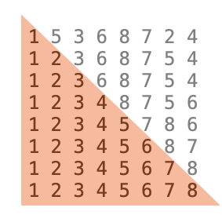

# Simple Sorting Algorithms

This folder contains the following simple sorting algorithms:

* [Bubble Sort:](https://github.com/Carla-de-Beer/Java/blob/master/data-structures-and-algorithms/sorting-algorithms/simple-sorting-algorithms/bubbleSort) Bubble sort (and reverse bubble sort).
* [Insertion Sort:](https://github.com/Carla-de-Beer/Java/blob/master/data-structures-and-algorithms/sorting-algorithms/simple-sorting-algorithms/InsertionSort) Insertion sort (and reverse insertion sort).
* [Selection Sort:](https://github.com/Carla-de-Beer/Java/blob/master/data-structures-and-algorithms/sorting-algorithms/simple-sorting-algorithms/SelectionSort) Selection sort (and reverse selection sort).

 

<figcaption>Fig.1: Bubble sort</figcaption>

<figcaption>Fig.2: Insertion sort</figcaption>

<figcaption>Fig.3: Selection sort</figcaption>
